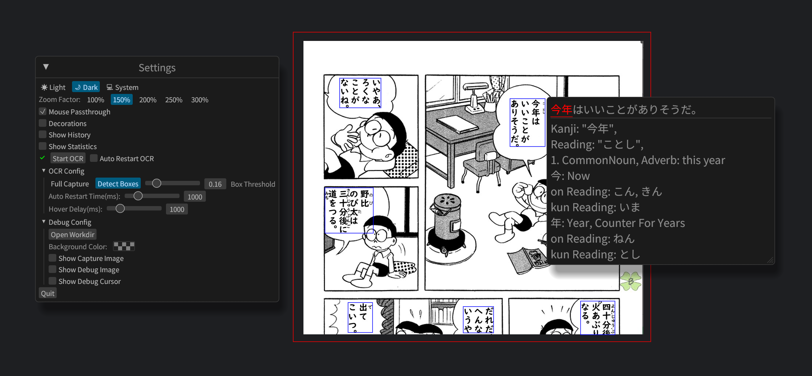

# Manga Overlay

Desktop Overlay for Japanese manga. The primary focus is learning japanese by making the search for kanji meanings
faster to enable reading manga.

Currently only Windows is supported.

## Setup
- Install [Rust](https://www.rust-lang.org/tools/install)
- Install [Python 3.13](https://www.python.org/downloads/) and add it as PATH variable
- Clone the repo with [Git](https://git-scm.com/downloads/win)
- Optional install Cuda for faster OCR
- Build a exe with "cargo build --release" or run with "cargo run"

## Usage

Select an area by dragging the background of the overlay. The app detects japanese text in the selected area and shows
the
result when hovering the blue rectangles. Scrolling in the blue rect shows the meanings of the detected kanji.
With a left click on the rect the text gets send to Google for translation and the result is cached in a sqlite db.
A right click keeps the info textbox open.

With "mouse passthrough" turned on the background becomes click through. This enables continues detection of japanese
text
in combination with the auto restart feature.
While hovering over a detected rect the ocr is paused.

A history of detected text can be displayed by enabling the "Show History" checkbox.\
With "Show Statistics" a basic overview of often looked at kanji is displayed.

## License

This project is licensed under the GPL-3.0 License - see the [LICENSE](LICENSE) file for details.

## Acknowledgments

This project was done with the usage of:

- [egui](https://github.com/emilk/egui) gui overlay
- [kanji-data](https://github.com/davidluzgouveia/kanji-data) kanji meaning dataset
- [comic-text-detector](https://github.com/dmMaze/comic-text-detector) trimmed model for textbox detection
- [manga-ocr](https://github.com/kha-white/manga-ocr) model/python scripts for text detection
